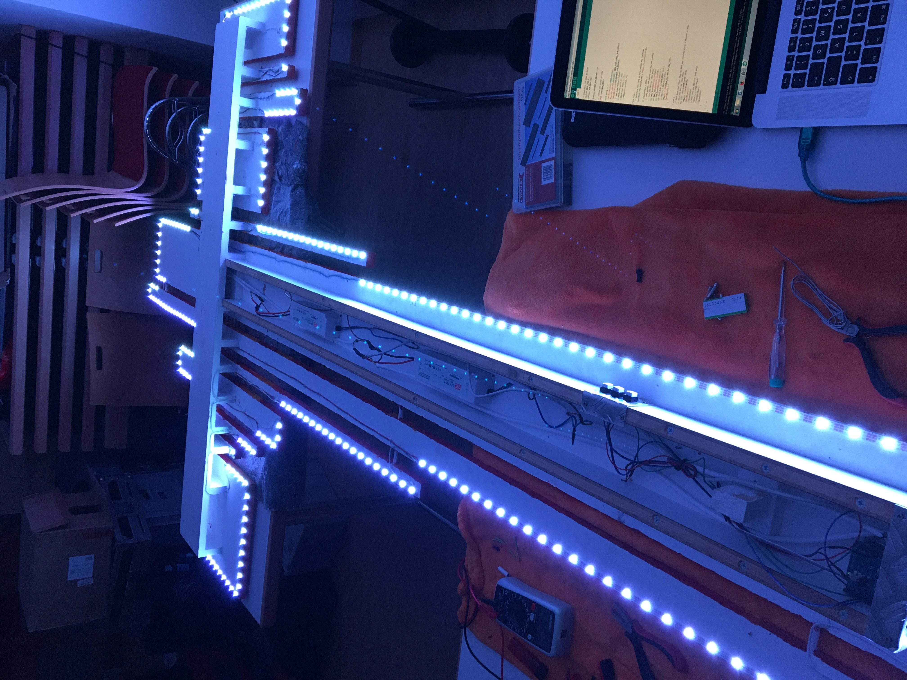
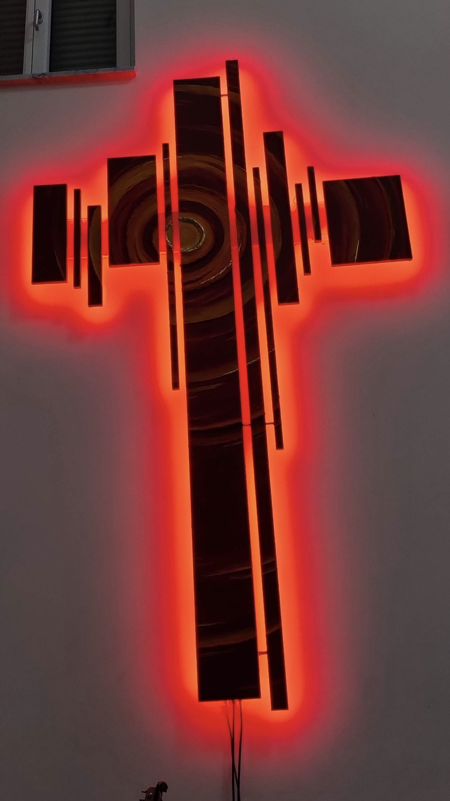
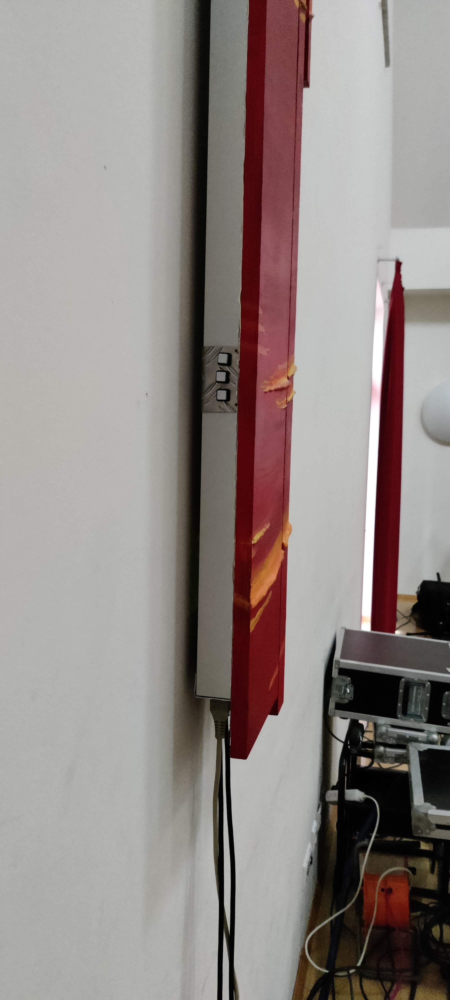
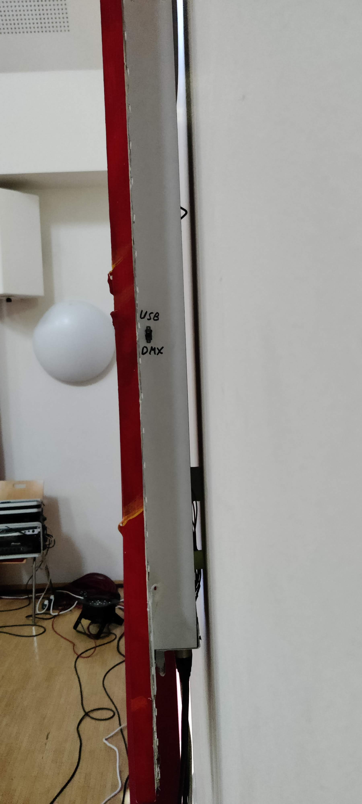
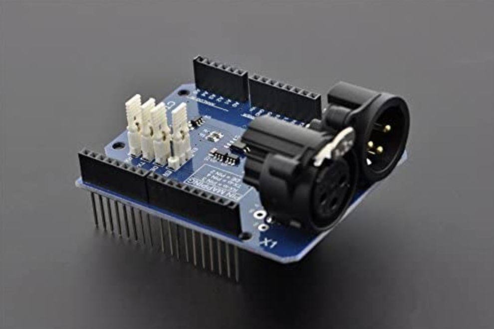
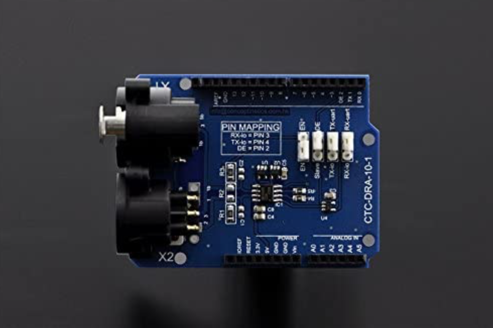
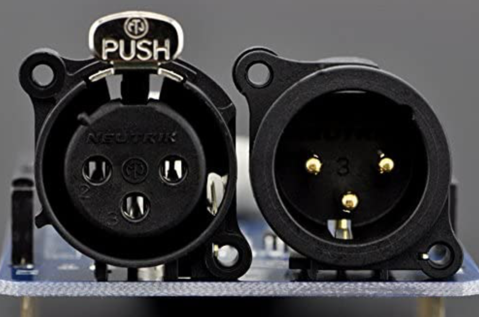
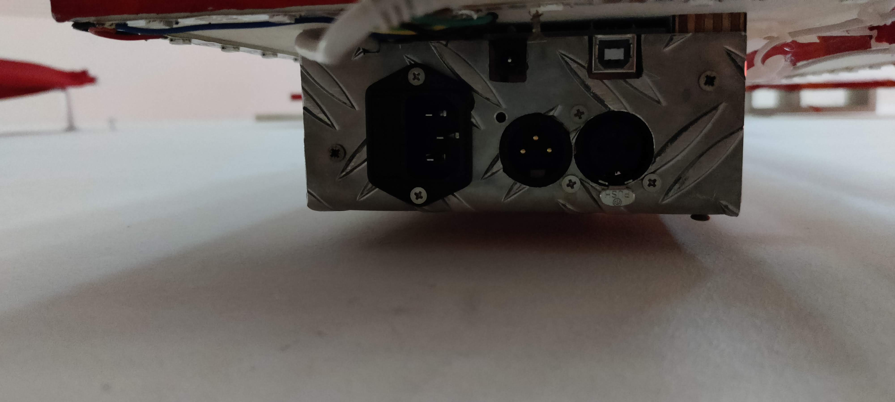

# LED-Kreuz Gemeindezentrum Sersheim

## Kurzbeschreibung

Der hier hinterlegte Code dient zur Ansteuerung des Kreuzes im Gemeindehaus in Sersheim. Dabei kann das Kreuz mit und ohne DMX genutzt werden. Die Hintergrundbeleuchtung wird über einen LED Streifen realisert der hinter dem Kreuz montiert ist. Gesteuert wird dieser Streifen von einem Arduino Uno.

| In Aktion                                                      | Rückseite                                                       |
| -------------------------------------------------------------- | --------------------------------------------------------------- |
|  |  |

## Betriebsanleitung

Das Kreuz wird über einen Kaltgerätestecker betrieben, dieser muss an der Unterseite des Kreuzes eingesteckt werden. Befindet sich kein DMX Kabel am Kreuz so leuchtet das Kreuz, kurze Zeit nach dem einstecken, auf.
Anschließend kann über die Taster auf der Linken Seite verschiedene Einstellungen geändert werden.

### Modi

- Statisch
  - Es wird immer eine feste Farbe angezeigt. Die Farbe kann im DMX betrieb über die entsprechenden Channels eingestellt werden, oder über den Farb-Taster wenn kein DMX Betrieb genutzt wird.
- Lauflicht
  - Das Lauflicht sind drei Lauflichter die im Uhrzeigersinn laufen. Die Farbe kann wie zuvor über die DMX-Channels oder über den Farbtaster eingestellt werden, abhängig von dem jeweiligen Modus.
- Funkeln
  - Hier leuchten in zufälliger Reihenfolge einzelne LEDs in der zuvor eingestellten Farbe auf.
- Feuer
  - Hier wird ein Feuereffekt über das Kreuz gelegt. Dieser ist farbunabhängig.

| Statisch                                                        | Lauflicht                                                            | Funkeln                                                        | Feuer                                                     |
| --------------------------------------------------------------- | -------------------------------------------------------------------- | -------------------------------------------------------------- | --------------------------------------------------------- |
|  |  |  |  |

### Betireb ohne DMX

| Knöpfe (linke Seite)                | Schalter (rechte Seite)              |
| ----------------------------------- | ------------------------------------ |
|  |  |

- Oberer Taster (funktioniert aktuell nicht)
  - Hier soll später die Helligkeit des Kreuzes einstellbar sein. Abstufungen in 100%, 75%, 50%, 25%. Aktull ist diese Funktion nicht verfügbar.
- Mittlere Taste
  - Hier können die einzelnen Farben durchgeschalten werden. Dies gilt nicht für den Feuereffekt, dieser ist von der Farbumschaltung ausgenommen.
  - Vorhandene Farben
    - Orange, Weiß, Rot, Blau, Grün
- Untere Taste
  - Diese Taste dient der Umschaltung der einzelnen Modi.

### DMX Betrieb

Um das Kreuz mit DMX betreiben zu können muss nur ein DMX Kabel in die entsprechende Buchse unten am Kreuz angesteckt werden. Erkennt das Kreuz einen DMX Master wird automatisch in den DMX Betrieb geschalten. Das Kreuz verhält sich dabei wie ein normaler DMX Teilnehmer im BUS. Die einzelnen Kanäle sind fest vorgegeben.
**WICHTIG:** Damit der DMX Modus funktioniert, muss der Schalter auf der rechten Seite des Kreuzes zwingend auf DMX gestellt sein. Dieser kann eigetnlich immer auf DMX gestellt bleiben. Einzige Ausnahme ist während dem Programmieren des Arduino. Siehe Kapitel Software.

#### Kanäle

- 43 = rot
- 44 = grün
- 45 = blau
- 46 = Effekte
  - 0-128 fester Farbe
  - 129-192 Lauflicht
  - 193-255 Funkeln
- 47 = Orange (dimmbar)
- 48 = Feuer
  - Ist der Wert dieses Kanals über 128 so werden alle anderen Kanäle nicht mehr beachtet.

## Hardwareaufbau

### DMX Schild

Damit der Arduino die DMX Signale auslesen kann wurde ein DMX Shield verwendet (Modell: DF DMX Shield). Dieses Shield benötigt eine eigene Arduino Library, diese liegt in dem Repo mit ab.
**WICHTIG:** Der Arduino kann nur dann programmiert werden wenn der Jumper auf dem Shield richtig gesetzt ist. Dies wird über den Schalter an der rechten Seite des Kreuzes gesteuert. Ist der Schieberegler auf USB gestellt, kann der Arduino programmiert werden. Befindet sich der Schieberegler auf DMX kann das DMX Signal gelesen werden.

| ISO-Ansicht                               | Darufsicht                                | Vorderansicht                               |
| ----------------------------------------- | ----------------------------------------- | ------------------------------------------- |
|  |  |  |

### Schaltplan

### Anschlüsse

Am Kreuz befinden sich insgesammt vier verschiedene Anschlüsse.

- USB
  - Dieser hat zwei verschiedene Aufgaben. Beim normalen Betrieb dient dieser als Stromversorgung des Arduino.
  - Muss der Arduino neu bespielt werden, so kann diese Buchse dafür genutzt werden.
    **WICHTIG:** Der Kaltgerätestecker sollte während der Programmierung nicht eingesteckt sein.
- Kaltgerätestecker
  - Dieser dient der Stromversorgung der LEDs, welche über Trafos betrieben werden. Weiter wird hier auch der Arduino über 5V gespeist.
- DMX Ein- und Ausgang
  - Wie üblich bei DMX Teilnehmern kann das Signal auch hier durchgeschliffen werden. Das Kreuz kann also an einer biliebigen Stelle im BUS angeschlossen werden.
- 9V Buchse
  - Ist die 9V Buchse des Arduino. Da nur 5V Transformatoren verbaut sind, kann dieser Eingang des Arduinos nicht verwendet werden um den Arduino zu betreiben.

## Software

Die Software des Kreuzes liegt im Repo ab. Sie ist seit der Fertigstellung nicht mehr geändert worden. Die Funktionen der Software sind in den obigen Kapiteln beschrieben. Programmiert wurde mit der normalen Arduino IDE. Die Bibliotheken zum kompilieren des Programms liegen als ZIP Datei im Repo ab. Sie müssen vor dem Kompilieren in den Libraries Ordner der Arduino IDE entpackt werden.
